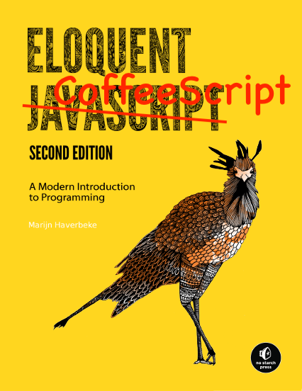

# Eloquent CoffeeScript

### Shamelessly adapted from _Eloquent Javascript_ by Marijn Haverbeke.
Licensed under a [Creative Commons attribution-noncommercial license](http://creativecommons.org/licenses/by-nc/3.0/). All code in this book may also be considered licensed under an [MIT license](http://opensource.org/licenses/MIT).

Illustrations by various artists: Cover by Wasif Hyder. Computer (introduction) and unicycle people (Chapter 21) by Max Xiantu. Sea of bits (Chapter 1) and weresquirrel (Chapter 4) by Margarita Martínez and José Menor. Octopuses (Chapter 2 and 4) by Jim Tierney. Object with on/off switch (Chapter 6) by Dyle MacGregor. Regular expression diagrams in Chapter 9 generated with regexper.com by Jeff Avallone. Game concept for Chapter 15 by Thomas Palef. Pixel art in Chapter 16 by Antonio Perdomo Pastor.

## Contents
0. [Introduction](intro)
1. [Values, Types, and Operators](ch01)
2. [Program Structure](ch02)
