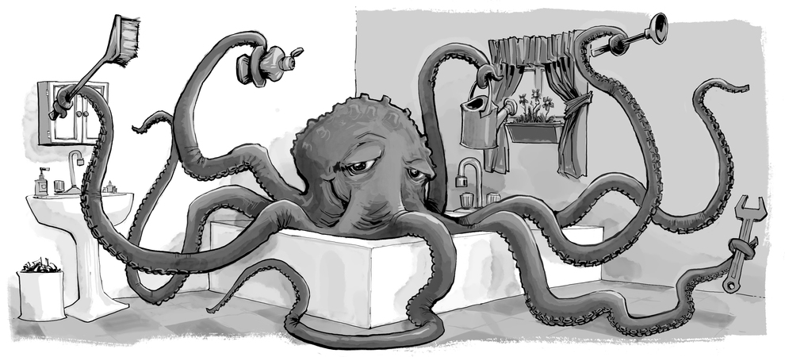

# Chapter 2: Program Structure

> And my heart glows bright red under my
> filmy, translucent skin and they have to administer 10cc of JavaScript
> to get me to come back. (I respond well to toxins in the blood.) Man,
> that stuff will kick the peaches right out your gills!
-\_why, Why's (Poignant) guide to Ruby


In this chapter, we will start to do things that can actually be called _programming_. We will expand our command of the JavaScript language beyond the nouns and sentence fragments we’ve seen so far, to the point where we can express some meaningful prose.

## Expressions and Statements

In Chapter 1, we made some values and then applied operators to them to get new values. Creating values like this is an essential part of every JavaScript program, but it is only a part.

A fragment of code that produces a value is called an expression. Every value that is written literally (such as `22` or `"psychoanalysis"`) is an expression. An expression between parentheses is also an expression, as is a binary operator applied to two expressions or a unary operator applied to one.

This shows part of the beauty of a language-based interface. Expressions can nest in a way very similar to the way subsentences in human languages are nested—a subsentence can contain its own subsentences, and so on. This allows us to combine expressions to express arbitrarily complex computations.

If an expression corresponds to a sentence fragment, a JavaScript statement corresponds to a full sentence in a human language. A program is simply a list of statements.

The simplest kind of statement is an expression with a semicolon after it. This is a program:

```
1
not false
```

It is a useless program, though. An expression can be content to just produce a value, which can then be used by the enclosing expression. A statement stands on its own and amounts to something only if it affects the world. It could display something on the screen—that counts as changing the world—or it could change the internal state of the machine in a way that will affect the statements that come after it. These changes are called side effects. The statements in the previous example just produce the values 1 and true and then immediately throw them away. This leaves no impression on the world at all. When executing the program, nothing observable happens.

## Variables

How does a program keep an internal state? How does it remember things? We have seen how to produce new values from old values, but this does not change the old values, and the new value has to be immediately used or it will dissipate again. To catch and hold values, CoffeeScript provides a thing called a variable.

```
  caught = 5 * 5
```

And that gives us our second kind of statement. `caught` is the name of the variable we are defining. It is followed by the name of the variable and, if we want to immediately give it a value, by an = operator and an expression.

The previous statement creates a variable called caught and uses it to grab hold of the number that is produced by multiplying 5 by 5.

After a variable has been defined, its name can be used as an expression. The value of such an expression is the value the variable currently holds. Here’s an example:

```coffee
ten = 10
print ten * ten
# → 100
```

Variable names can be any word that isn’t a reserved word (such as `not`). They may not include spaces. Digits can also be part of variable names—catch22 is a valid name, for example—but the name must not start with a digit. A variable name cannot include punctuation, except for the characters $ and \_.

When a variable points at a value, that does not mean it is tied to that value forever. The = operator can be used at any time on existing variables to disconnect them from their current value and have them point to a new one.

```coffee
  mood = "light"
  print mood
  # → light
  mood = "dark"
  print mood
  # → dark
```

You should imagine variables as tentacles, rather than boxes. They do not contain values; they grasp them—two variables can refer to the same value. A program can access only the values that it still has a hold on. When you need to remember something, you grow a tentacle to hold on to it or you reattach one of your existing tentacles to it.



Let’s look at an example. To remember the number of dollars that Luigi still owes you, you create a variable. And then when he pays back $35, you give this variable a new value.

```coffee
luigisDebt = 140
luigisDebt = luigisDebt - 35
print luigisDebt
# → 105
```

When you define a variable without giving it a value, the tentacle has nothing to grasp, so it ends in thin air. If you ask for the value of an empty variable, you’ll get the value undefined.

## Keywords and reserved words

Words with a special meaning, such as var, are keywords, and they may not be used as variable names. There are also a number of words that are “reserved for use” in future versions of CoffeeScript. These are also officially not allowed to be used as variable names, though some CoffeeScript environments do allow them. The full list of keywords and reserved words is rather long.

```
case default function var void with const let enum
export import native __hasProp __extends __slice __bind
__indexOf implements interface package private protected
public static yield true false null this new delete
typeof in arguments eval instanceof return throw
break continue debugger if else switch for while do
try catch finally class extends super undefined then
unless until loop of by when and or is isnt not
yes no on off
```

## The environment

The collection of variables and their values that exist at a given time is called the environment. When a program starts up, this environment is not empty. It always contains variables that are part of the language standard, and most of the time, it has variables that provide ways to interact with the surrounding system. For example, in a browser, there are variables and functions to inspect and influence the currently loaded website and to read mouse and keyboard input.

## Functions

A lot of the values provided in the default environment have the type function. A function is a piece of program wrapped in a value. Such values can be applied in order to run the wrapped program. For example, in a browser environment, the variable `alert` holds a function that shows a little dialog box with a message. It is used like this:

```coffee
alert("Good morning!")
```

Executing a function is called _invoking_, _calling_, or _applying_ it. You can call a function by putting parentheses after an expression that produces a function value. Usually you’ll directly use the name of the variable that holds the function. The values between the parentheses are given to the program inside the function. In the example, the `alert` function uses the string that we give it as the text to show in the dialog box. Values given to functions are called _arguments_. The `alert` function needs only one of them, but other functions might need a different number or different types of arguments.

In CoffeeScript, parentheses are optional when invoking a function with at least one argument. Often we'll use them anyway, to clarify our program's intent. This is another way to write the previous program:

```coffee
alert "Good morning!"
```

## The `print` function

The `alert` function can be useful as an output device when experimenting, but clicking away all those little windows will get on your nerves. In past examples, we’ve used `print` to output values. Framer, and this tutorial page, provide a `print` function that writes out its arguments to some text output device. You may also see `console.log` used in code meant for the browser. In Framer, the output of `print` lands in the console, which appears over the preview window.

When running the examples, or your own code, on the pages of this book, `print` output will be shown after the example, instead of in the browser’s JavaScript console.

```coffee
x = 30
print "the value of x is " + x
# → the value of x is 30
```

## Return values
Showing a dialog box or writing text to the screen is a _side effect_. A lot of functions are useful because of the side effects they produce. Functions may also produce values, and in that case, they don’t need to have a side effect to be useful. For example, the function `Math.max` takes any number of number values and gives back the greatest.

```coffee
print Math.max(2, 4)
# → 4
```

When a function produces a value, it is said to _return_ that value. Anything that produces a value is an expression in JavaScript, which means function calls can be used within larger expressions. Here a call to `Math.min`, which is the opposite of `Math.max`, is used as an input to the plus operator:

```coffee
print Math.min(2, 4) + 100
# → 102
```

The next chapter explains how to write your own functions.

## Control flow

When your program contains more than one statement, the statements are executed, predictably, from top to bottom. As a basic example, this program has two statements. The first one asks the user for a number, and the second, which is executed afterward, shows the square of that number.

```coffee
theNumber = Number(prompt("Pick a number", ""))
print "Your number is the square root of " + theNumber * theNumber
```

The function `Number` converts a value to a number. We need that conversion because the result of prompt is a string value, and we want a number. There are similar functions called `String` and `Boolean` that convert values to those types.

Here is the rather trivial schematic representation of straight control flow:


## Conditional execution

Executing statements in straight-line order isn't the only option we have. An alternative is _conditional execution_, where we choose between two different routes based on a _Boolean_ value. _Booleans_ are values that are either true or false.

Conditional execution looks like this:


Conditional execution is written with the `if` keyword in JavaScript. In the simple case, we just want some code to be executed if, and only if, a certain condition holds. For example, in the previous program, we might want to show the square of the input only if the randomly-generated number is even.

```coffee
theNumber = Number prompt("Pick a number", "")
if not isNaN theNumber
  print "Your number is the square root of " + theNumber * theNumber
```

With this modification, if you enter "cheese", no output will be shown.

The keyword `if` executes or skips a statement depending on the value of a Boolean expression. The deciding expression is written after the keyword, between parentheses, followed by the statement to execute.

The `isNaN` function is a standard CoffeeScript function that returns true only if the argument it is given is NaN. The `Number` function happens to return NaN when you give it a string that doesn’t represent a valid number. Thus, the condition translates to “unless theNumber is not-a-number, do this”.

Notice that there are two functions used to determine the value of `theNumber`. `Number` is evaluated on the output of `prompt`. This is called _composition_, and it's a very powerful pattern for expressing chains of operations.

You often won’t just have code that executes when a condition holds true, but also code that handles the other case. This alternate path is represented by the second arrow in the diagram. The else keyword can be used, together with if, to create two separate, alternative execution paths.

```coffee
theNumber = Number(prompt("Pick a number", ""))
if not isNaN theNumber
  print "Your number is the square root of " + theNumber * theNumber
else
  print "Hey. Why didn't you give me a number?"
```

If we have more than two paths to choose from, multiple `if`/`else` pairs can be “chained” together. Here’s an example:

```coffee
num = Number(prompt("Pick a number", "0"))

if num < 10
  print "Small"
else if num < 100
  print "Medium"
else
  print "Large"
```

The program will first check whether `num` is less than 10. If it is, it chooses that branch, shows `"Small"`, and is done. If it isn’t, it takes the `else` branch, which itself contains a second `if`. If the second condition `(< 100)` holds, that means the number is between 10 and 100, and `"Medium"` is shown. If it doesn’t, the second, and last, `else` branch is chosen.

The flow chart for this program looks something like this:


## `while` and `do` Loops

Consider a program that prints all even numbers from 0 to 12. One way to write this is as follows:

```coffee
print 0
print 2
print 4
print 6
print 8
print 10
print 12
```

That works, but the idea of writing a program is to make something less work, not more. If we needed all even numbers less than 1,000, the previous would be unworkable. What we need is a way to repeat some code. This form of control flow is called a _loop_:


Looping control flow allows us to go back to some point in the program where we were before and repeat it with our current program state. If we combine this with a variable that counts, we can do something like this:

```coffee
number = 0
while number <= 12
  print number
  number = number + 2
# → 0
# → 2
#   … etcetera
```

A statement starting with the keyword `while` creates a loop. The word `while` is followed by an expression and then a statement, much like `if`. The loop executes that statement as long as the expression produces a value that is `true` when converted to Boolean type.

In this loop, we want to both print the current number and add two to our variable. After our expression, we indent any statements we want to run repeatedly. This groups these statements together, making them count as a single statement. A sequence of indented statements is called a block.

The variable `number` demonstrates the way a variable can track the progress of a program. Every time the loop repeats, `number` is incremented by 2. Then, at the beginning of every repetition, it is compared with the number 12 to decide whether the program has done all the work it intended to do.

As an example that actually does something useful, we can now write a program that calculates and shows the value of 2<sup>10</sup> (2 to the 10th power). We use two variables: one to keep track of our result and one to count how often we have multiplied this result by 2. The loop tests whether the second variable has reached 10 yet and then updates both variables.

```coffee
result = 1
counter = 0
while counter < 10
  result = result * 2
  counter = counter + 1
print result
# → 1024
```

The counter could also start at 1 and check for `<= 10`, but, for reasons that will become apparent in Chapter 4, it is a good idea to get used to counting from 0.

## Indenting code

You've probably noticed the spaces I've put in front of some statements. In CoffeeScript (unlike JavaScript) these spaces are required. This is how the compiler understands which statements make up a block and should be executed together. In many other languages, you indicate which statements are in a block using curly braces (`{}`) and indent these lines just for your own convenience. This is one of many instances where CoffeeScript saves you a bit of extra typing by looking at the structure of your code and inferring its meaning.

## Breaking out of a loop

Having the loop’s condition produce `false` is not the only way a loop can finish. There is a special statement called `break` that has the effect of immediately jumping out of the enclosing loop.

This program illustrates the `break` statement. It finds the first number that is both greater than or equal to 20 and divisible by 7.

```coffee
current = 20
while true
  if current % 7 == 0
    break
  current = current + 1
print current
```

Using the remainder (%) operator is an easy way to test whether a number is divisible by another number. If it is, the remainder of their division is zero.

The expression part of the `while` loop in the example will always evaluate to true. This means that the loop will never stop unless the `break` statement inside is executed.

If you were to leave out that break statement or accidentally write a condition that always produces true, your program would get stuck in an infinite loop. A program stuck in an infinite loop will never finish running, which is usually a bad thing.

If you create an infinite loop in one of the examples on these pages, you’ll usually be asked whether you want to stop the script after a few seconds. If that fails, you will have to close the tab that you’re working in, or on some browsers close your whole browser, in order to recover.

The `continue` keyword is similar to `break`, in that it influences the progress of a loop. When `continue` is encountered in a loop body, control jumps out of the body and continues with the loop’s next iteration.

## Updating variables succinctly

Especially when looping, a program often needs to "update" a variable to hold a value based on that variable's previous value.

```
counter = counter + 1
```

CoffeeScript provides a shortcut for this:

```
counter += 1
```

Similar shortcuts work for many other operators, such as `result *= 2` to double result or `counter -= 1` to count downward.

This allows us to shorten our counting example a little more.

```coffee
number = 0
while number <= 12
  print number
  number += 2
```

For `counter += 1` and `counter -= 1`, there are even shorter equivalents: `counter++` and `counter--`.

## Dispatching on a value with `switch`
It is common for code to look like this:

```
if variable == "value"
  action1()
else if variable == "value2"
  action2()
else if variable == "value3"
  action3()
else
  defaultAction()
```  

There is a construct called `switch` that is intended to solve such a "dispatch in a more direct way. Here is an example:

```coffee
switch prompt "What is the weather like?"
  when "rainy"
    print "Remember to bring an umbrella."
  when "sunny"
    print "Dress lightly."
  when "cloudy"
   print "Go outside."
  else
    print "Unknown weather type!"
```

In CoffeeScript there is an even more succinct way to express this type of logic, by evaluating an expression in `when`:

```coffee
score = 93
grade = switch
  when score < 60 then 'F'
  when score < 70 then 'D'
  when score < 80 then 'C'
  when score < 90 then 'B'
  else 'A'
print grade
```

You may put any number of `when` labels inside the block operated by `switch`. The program will jump to the label that corresponds to the value that `switch` was given, or to `else` if no matching value is found.

## Capitalization

Variable names may not contain spaces, yet it is often helpful to use multiple words to clearly describe what the variable represents. These are pretty much your choices for writing a variable name with several words in it:

```
fuzzylittleturtle
fuzzy_little_turtle
FuzzyLittleTurtle
fuzzyLittleTurtle
```

The first style can be hard to read. Personally, I like the look of the underscores, though that style is a little painful to type. The standard JavaScript functions, and most JavaScript programmers, follow the bottom style—they capitalize every word except the first. It is not hard to get used to little things like that, and code with mixed naming styles can be jarring to read, so we will just follow this convention.

In a few cases, such as the Number function, the first letter of a variable is also capitalized. This was done to mark this function as a constructor. What a constructor is will become clear in Chapter 6. For now, the important thing is not to be bothered by this apparent lack of consistency.

## Comments
Often, raw code does not convey all the information you want a program to convey to human readers, or it conveys it in such a cryptic way that people might not understand it. At other times, you might just feel poetic or want to include some thoughts as part of your program. This is what comments are for.

A comment is a piece of text that is part of a program but is completely ignored by the computer. CoffeeScript has two ways of writing comments. To write a single-line comment, you can use a hash character (#) and then the comment text after it.

```
accountBalance = calculateBalance account;
# It's a green hollow where a river sings
accountBalance.adjust()
# Madly catching white tatters in the grass.
report = new Report()
# Where the sun on the proud mountain rings:
addToReport accountBalance, report
# It's a little valley, foaming like light in a glass.
```

A `#` comment goes only to the end of the line. A section of text between `###` and `###` will be ignored, regardless of whether it contains line breaks. This is often useful for adding blocks of information about a file or a chunk of program.

```
###
I first found this number scrawled on the back of one of
my notebooks a few years ago. Since then, it has often
dropped by, showing up in phone numbers and the serial
numbers of products that I've bought. It obviously likes
me, so I've decided to keep it.
###
myNumber = 11213
```

## Summary
You now know that a program is built out of statements, which themselves sometimes contain more statements. Statements tend to contain expressions, which themselves can be built out of smaller expressions.

Putting statements after one another gives you a program that is executed from top to bottom. You can introduce disturbances in the flow of control by using conditional (`if`, `else`, and `switch`) and looping (`while`) statements.

Variables can be used to file pieces of data under a name, and they are useful for tracking state in your program. The environment is the set of variables that are defined. CoffeeScript systems always put a number of useful standard variables into your environment.

Functions are special values that encapsulate a piece of program. You can invoke them by writing `functionName(argument)`, or `functionName argument1, argument2`. Such a function call is an expression, and may produce a value.

## Exercises

If you are unsure how to try your solutions to exercises, refer to the introduction.

Each exercise starts with a problem description. Read that and try to solve the exercise. If you run into problems, consider reading the hints after the exercise. If you want to learn something from the exercises, I recommend looking at the solutions only after you’ve solved the exercise, or at least after you’ve attacked it long and hard enough to have a slight headache.

### Looping a Triangle

Write a loop that makes seven calls to print to output the following triangle:

```
#
##
###
####
#####
######
#######
```

It may be useful to know that you can find the length of a string by writing `.length` after it.

```
abc = "abc"
print abc.length
# → 3
```

Most exercises contain a piece of code that you can modify to solve the exercise. Remember that you can click code blocks to edit them.

```coffee
# Your code here.

###hint
You can start with a program that simply prints out the numbers 1 to 7, which you can derive by making a few modifications to the even number printing example given earlier in the chapter, where the `while` loop was introduced.

Now consider the equivalence between numbers and strings of hash characters. You can go from 1 to 2 by adding 1 (+= 1). You can go from "#" to "##" by adding a character (+= "#"). Thus, your solution can closely follow the number-printing program.
###
```

### FizzBuzz
Write a program that uses `print` to print all the numbers from 1 to 100, with two exceptions. For numbers divisible by 3, print `"Fizz"` instead of the number, and for numbers divisible by 5 (and not 3), print `"Buzz"` instead.

When you have that working, modify your program to print `"FizzBuzz"`, for numbers that are divisible by both 3 and 5 (and still print `"Fizz"` or `"Buzz"` for numbers divisible by only one of those).

(This is actually an interview question that has been claimed to weed out a significant percentage of programmer candidates. So if you solved it, you’re now allowed to feel good about yourself.)

```coffee
# Your code here.

###hint
Going over the numbers is clearly a looping job, and selecting what to print is a matter of conditional execution. Remember the trick of using the remainder (%) operator for checking whether a number is divisible by another number (has a remainder of zero).

In the first version, there are three possible outcomes for every number, so you’ll have to create an `if/else` `if/else` chain.

The second version of the program has a straightforward solution and a clever one. The simple way is to add another “branch” to precisely test the given condition. For the clever method, build up a string containing the word or words to output, and print either this word or the number if there is no word, potentially by making elegant use of the || operator.
###
```

### Chess Board
Write a program that creates a string that represents an 8×8 grid, using newline characters to separate lines. At each position of the grid there is either a space or a “#” character. The characters should form a chess board.

Passing this string to `print` should show something like this:

```
 # # # #
# # # #
 # # # #
# # # #
 # # # #
# # # #
 # # # #
# # # #
```

When you have a program that generates this pattern, define a variable size = 8 and change the program so that it works for any size, outputting a grid of the given width and height.

```coffee
# Your code here.

###hint
The string can be built by starting with an empty one ("") and repeatedly adding characters. A newline character is written "\n".

Use `print` to inspect the output of your program.

To work with two dimensions, you will need a loop inside of a loop. Put curly braces around the bodies of both loops to make it easy to see where they start and end. Try to properly indent these bodies. The order of the loops must follow the order in which we build up the string (line by line, left to right, top to bottom). So the outer loop handles the lines and the inner loop handles the characters on a line.

You’ll need two variables to track your progress. To know whether to put a space or a hash sign at a given position, you could test whether the sum of the two counters is even (% 2).

Terminating a line by adding a newline character happens after the line has been built up, so do this after the inner loop but inside of the outer loop.
###
```
